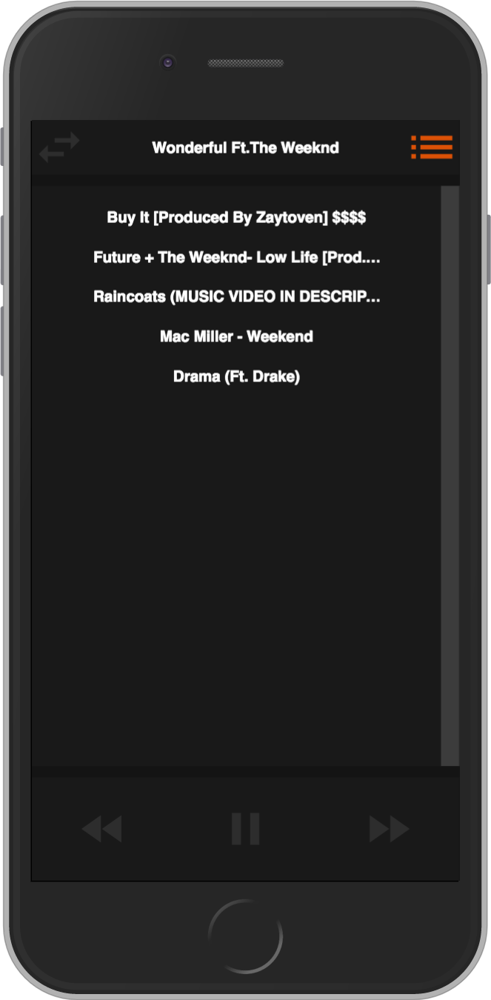

# StreamCloud

StreamCloud is a small SoundCloud clone that allows the user to stream and queue up tracks from SoundCloud. The goal of this project was to explore and demonstrate the ability of SoundCloud's API with modern, framework-less JavaScript.

<div align="center">
  
  
  
</div>


## Local Setup

This project was set up using [Yarn](https://github.com/yarnpkg/yarn) package manager, however, npm can replace commands where Yarn is used.

### Dependencies

From the root directory of the project install dependencies with
```
yarn install
```

### Keys

Place your SoundCloud client ID in `config.json.template` and remove `.template` from the name of the file.

### Start

To start the application run
```
yarn start
```

This will run webpack to bundle all static files and watch for changes, as well as fire up a local express server on port 3000 to serve these files (thanks [Concurrently](https://github.com/kimmobrunfeldt/concurrently)). Visit `localhost:3000` to see the application.

### Testing

Facebook's [Jest](https://github.com/facebook/jest) framework is used for unit testing the client side JavaScript. To start testing, run
```
yarn test
```

## Challenges

### Asynchronous Requests

One of the toughest problems to tackle while building this application was writing a streaming algorithm that could work asynchronously with a queue. In order to properly account for the asynchrony of user requests and the SoundCloud player streaming tracks, edge cases involving the player and its 'finish' event listener had to be implemented. This includes the ability to enqueue a track if the player is currently streaming and not allowing duplicate tracks in the queue to avoid uncaught promise errors with the player (this can be changed in the future). A recursive descent is made when the current player is finished playing, which allows a new player to be used for the next track.
```JavaScript
async stream(track) {
  if (!this.playing) {
    await this.immediateStream(track);

    this.currentPlayer.on('finish', () => {
      this.toggleControls(false);
      this.pushToPrevious(track);
      this.trackTitle.textContent = '';
      if (this.queue.length > 0) {
        let nextTrack = this.dequeue();
        this.stream(nextTrack);
      }
    });
  }
  else if (!this.queue.includes(track) && this.currentPlayer.options.soundId != track.id)
    this.enqueue(track);
  else alert(`${track.title} is already in the player or queue`);
}

async immediateStream(track) {
  let player = await this.startPlayer(track);
  this.currentPlayer = player;
  this.currentTrack = track;
  this.trackTitle.textContent = track.title;
  this.toggleControls(true);
  this.togglePlayState(true);
}
```

### Data Structures

Another interesting challenge that I encountered while building the functionality of the media player was constructing the way the tracks and queue are handled when the skip track or back track buttons are pressed. In order to make the track queue work alongside the ability to skip forward and backward, I used a Queue structure for the queue (FIFO) and Stack implementation for the previously played tracks (LIFO). This allowed me to (when the back track button is pressed) pop a track off the the previous track stack and play it, and insert the previously playing track into the beginning of the queue to be played next. When the skip forward button is pressed, I push the current track to the previous track stack and dequeue the next track to be played. There are probably other ways to implement this feature, but this implementation seemed intuitive at the time.

```JavaScript
skipTrack() {
  if (this.queue.length > 0) {
    this.currentPlayer.seek(0);
    this.togglePlayState(false);
    this.pushToPrevious(this.currentTrack);
    let nextTrack = this.dequeue();
    this.stream(nextTrack);
  }
}

backTrack() {
  let prevTrack = this.previousTracks.pop();
  if (!!prevTrack) {
    this.currentPlayer.seek(0);
    this.togglePlayState(false);
    this.queue.unshift(this.currentTrack);
    this.stream(prevTrack);
  }
}

pushToPrevious(track) {
  if (this.previousTracks.length < 30) this.previousTracks.push(track);
  else {
    this.previousTracks.shift();
    this.previousTracks.push(track);
  }
}
```

### Google Chrome Player Bug

If the SoundCloud player sees the same track again (i.e. skip to the next track then go back to the previous one), two pause events are fired, yet the track will continue to play. This throws the playing state out of sync with the player. In order to pause the player, the play/pause button will need to be toggled a couple times.

In order to fix this I had to do something a little hacky for the time being. When the play/pause button is pressed, it will play-pause-play or pause-play-pause:

```JavaScript
togglePlayState(play) {
  if (play) {
    this.currentPlayer.play();
    this.currentPlayer.pause();
    this.currentPlayer.play();
  }
  else {
    this.currentPlayer.pause();
    this.currentPlayer.play();
    this.currentPlayer.pause();
  }
  this.playing = play;
  this.togglePlayButton(play);
}
```

Unfortunately, this throws an error whenever a track is paused:
```
Uncaught (in promise) DOMException: The play() request was interrupted by a call to pause().
```

It doesn't seem to cause any issues, but it's definitely something worth investigating. When testing in Firefox, the error is not thrown.

### Architecture

Being a small enough project (and a demonstration of technical ability), I decided to not use a front-end framework and relied mainly on the newer features of ECMAScript alongside webpack to create a modular front-end. Experience working with React allowed me to model the front-end in a way that allows for reusable components.


Without relying on a framework, directly handling how state changes throughout the app reflect in the UX/UI and vice versa poised to be a bit cumbersome. For future improvements, I would most likely end up rewriting the application using React to make state management a lot cleaner throughout.

## Future Improvements

### Queue Recommendations

I think it would be pretty cool to build a recommendation  feature based on data collected from the tracks currently in the queue (BPM, genre, artist/username). The user could simply choose whether or not to add the recommended track(s) to the queue with a single click.

### Animations

A more intuitive and smooth UX could be achieved with animations throughout the application (slide up/down queue, slide in/out screen switching, etc). For time constraint purposes, animations were originally left out.

### Framework Rewrite

The beauty behind writing some "vanilla" JS is that one starts to appreciate and see where modern day frameworks step in to make our lives much easier. I would definitely consider rewriting the application using React or something alike to better manage state throughout the application (were it to become bigger and harder to manage). I can definitely see benefits for this in media applications, where small state changes in particular areas could lead to the rest of the application accomodating.

### Better Searching

While building the project I started to realize my focus shifted from the original idea of creating different ways to filter searches to building out a little media player. This has left the searching capability pretty rudimentary. I would definitely consider adding searching filters (genre, likes, plays) in the future.
