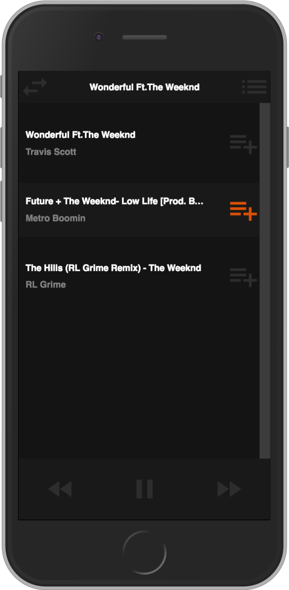

# StreamCloud
#### SoundCloud Internship Code Challenge 2017

StreamCloud is a small SoundCloud clone that allows the user to stream and queue up tracks from SoundCloud. The goal of this project was to explore and demonstrate the ability of SoundCloud's API with modern, framework-less JavaScript.

<div align="center">
  
  
</div>


## Local Setup

This project was set up using [Yarn](https://github.com/yarnpkg/yarn) package manager, however, npm can replace commands where Yarn is used.

### Dependencies

From the root directory of the project install dependencies with
```
yarn install
```

### Keys

Place your SoundCloud client ID in `config.json.template` and remove `.template` from the name of the file.

### Start

To start the application run
```
yarn start
```

This will run webpack to bundle all static files and watch for changes, as well as fire up a local express server on port 3000 to serve these files (thanks [Concurrently](https://github.com/kimmobrunfeldt/concurrently)). Visit `localhost:3000` to see the application.

### Testing

Facebook's [Jest](https://github.com/facebook/jest) framework is used for unit testing the client side JavaScript. To start testing, run
```
yarn test
```

## Challenges

### Asynchronous requests

One of the toughest problems to tackle while building this application was writing a streaming algorithm that could work asynchronously with a queue. In order to properly account for the asynchrony of user requests and the SoundCloud player streaming tracks, edge cases involving the player and its 'finish' event listener had to be implemented. This includes the ability to enqueue a track if the player is currently streaming and not allowing duplicate tracks in the queue to avoid uncaught promise errors with the player (this can be changed in the future). A recursive descent is made when the current player is finished playing, which allows a new player to be used for the next track, avoiding some promise interruption errors.
```JavaScript
async stream(track) {
  if (!this.playing) {
    this.playing = true;
    let player = await this.startPlayer(track);
    this.currentPlayer = player;
    player.play();
    this.toggleControls(true);

    player.on('finish', () => {
      this.playing = false;
      this.toggleControls(false);
      if (this.queue.length > 0) {
        let nextTrack = this.dequeue();
        this.stream(nextTrack);
      }
    });
  }
  else if (this.playing && !this.queue.includes(track) && this.currentPlayer.options.soundId != track.id)
    this.enqueue(track);
  else alert(`${track.title} is already in the queue`);
}
```

### Architecture

Being a small enough project (and a demonstration of technical ability), I decided to not use a front-end framework and relied mainly on the newer features of ECMAScript alongside webpack to create a modular front-end. Experience working with React allowed me to model the front-end in a way that allows for reusable components. It is by no means as elegant as if I were to use a framework, however it gets the job done without many issues. For future improvements, I would most likely end up rewriting the application using React to make state management a lot easier throughout.

## Future Ideas

### Queue Recommendations

I think it would be pretty cool to build a recommendation  feature based on data collected from the tracks currently in the queue (BPM, genre, artist/username). The user could simply choose whether or not to add the recommended track(s) to the queue with a single click.

### Framework Rewrite

The beauty behind writing some "vanilla" JS is that one starts to appreciate and see where modern day frameworks step in to make our lives much easier. I would definitely consider rewriting the application using React or something alike to better manage state throughout the application (were it to become bigger and harder to manage). I can definitely see benefits for this in media applications, where small state changes in particular areas could lead to the rest of the application accomodating.

### Better Searching

While building the project I started to realize my focus shifted from the original idea of creating different ways to filter searches to building out a little media player. This has left the searching capability pretty rudimentary. I would definitely consider adding searching filters (genre, likes, plays) in the future.

----
Overall, I thoroughly enjoyed building this little project and working with the SoundCloud API. I think this is an excellent way of screening for potential job candidates and should be more of a norm if it isn't already.
